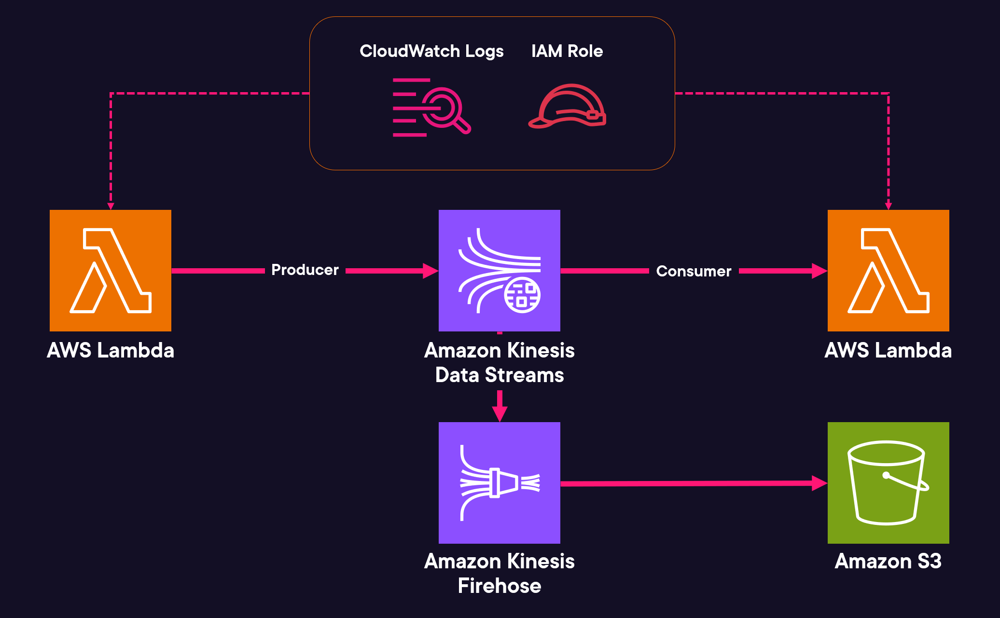

# Amazon Kinesis Real-Time Streaming Project

This personal project demonstrates how to build a real-time streaming architecture using Amazon Kinesis, AWS Lambda, and Kinesis Data Firehose. I created this project to explore how to process, analyze, and deliver streaming data in real time, with a focus on practical use cases like IoT and telemetry data.

## Project Flow

Below is the flow diagram that outlines the architecture of this project:



## Overview

The project consists of three main components:

1. **Kinesis Data Stream**: Acts as the backbone for streaming data.
2. **Lambda Functions**:
   - **Producer Lambda**: Generates and sends events to the Kinesis Data Stream.
   - **Consumer Lambda**: Consumes, decodes, and processes events from the Kinesis Data Stream.
3. **Kinesis Data Firehose**: Delivers streaming data from the Kinesis Data Stream into an S3 bucket for storage and further analysis.

## Prerequisites

- **AWS Account**: Ensure you have an AWS account with appropriate permissions.
- **AWS CLI (Optional)**: For command-line operations.
- **Python 3.11**: Used for the Lambda functions.
- Familiarity with AWS Lambda, Amazon Kinesis, and S3.

## Project Setup

### 1. Create a Kinesis Data Stream

- **Service**: Amazon Kinesis
- **Stream Name**: `TelemetricsStream`
- **Capacity Mode**: On-demand

### 2. Develop the Producer Lambda Function

This Lambda function continuously sends telemetry events to the Kinesis Data Stream.

#### Steps:
1. Create a Lambda function named **`produceKinesisEvents`** using Python 3.11.
2. Use an existing IAM role (e.g., `KinesisLambdaRole`) with the necessary permissions.
3. Insert the following code in `producer_lambda/produceKinesisEvents.py`:

   ```python
   import json
   import boto3
   import uuid
   import random
   import time

   def lambda_handler(event, context):
       client = boto3.client('kinesis')
       
       while True:
           data = {
               "id": str(uuid.uuid4()),
               "latitude": random.uniform(-90, 90),
               "longtitude": random.uniform(0, 180)
           }
           
           response = client.put_record(
               StreamName="TelemetricsStream",
               PartitionKey="geolocation",
               Data=json.dumps(data)
           )
           
           print(response)
           time.sleep(random.random())
